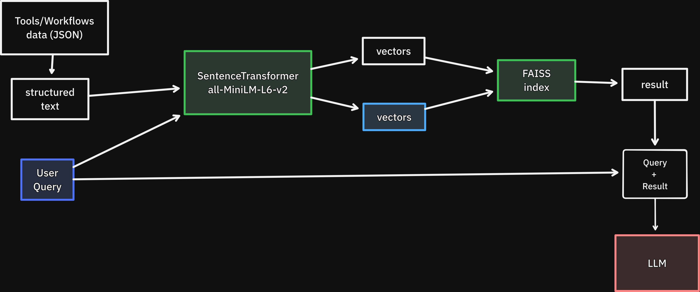

# Galaxy Tools and Workflows RAG Knowledge Base

This project implements a Retrieval Augmented Generation (RAG) system to create a searchable knowledge base of Galaxy tools and workflows.

## Project Overview

The goal is to build a system that can answer natural language queries about Galaxy tools and workflows. This is achieved by:
1.  Creating a database of all available Galaxy tools and workflows.
2.  Processing this data into a structured text format.
3.  Generating vector embeddings for each tool and workflow document.
4.  Storing these embeddings in a searchable vector index.
5.  Using a Large Language Model (LLM) to generate answers based on the retrieved information.

## Architecture



## Data Processing

### Data Extraction and Formatting
Tool and workflow information is extracted and converted into a standardized text format.

#### Tool Example
```text
NAME: NCBI Accession Download
DESCRIPTION: Download sequences from GenBank/RefSeq by accession through the NCBI ENTREZ API
IS_WORKFLOW_COMPATIBLE: true
PANEL_SECTION_NAME: Get Data
```

#### Workflow Example
```text
TYPE: Workflow
TITLE: post-curation-processing
DESCRIPTION: Post-curation processing workflow for VGP assemblies...
WORKFLOW_CLASS: Galaxy
TOOLS USED:
- cutadapt
- mashmap
- gfastats
- JBrowse2
- imagemagick_image_montage
```

### Document Chunking

Each tool or workflow is treated as a single, distinct document.

## RAG Pipeline

1. Embedding Generation: Each document is passed through an embedding model from Hugging Face's sentence-transformers library to create a vector representation.
    - **Model**: sentence-transformers/all-MiniLM-L6-v2

2. Vector Storage: The generated embeddings and their corresponding metadata are stored in a FAISS index for efficient similarity searching.

3. Retrieval and Generation:

    - When a user submits a prompt, the system searches the vector database to find the most relevant documents.
    - The retrieved documents are then passed as context to a locally running LLM (via Ollama) to generate a final answer.

### Supported Embedding Query Types
The embeddings from the current schema can support the following types of queries:

- Intent-based tool search (e.g., “methods for comparing distance matrices”)
- Functional matching (e.g., “matrix comparison tools”)
- Analysis type search (e.g., “PCA-like methods”, “dimensionality reduction tools”)
- Workflow filtering (e.g., “workflow-compatible diversity tools”, “pipeline-ready QIIME2 tools”)
- Section/category search (e.g., “QIIME2 ordination tools”, “QIIME2 diversity analysis”)
- Description/name fuzzy matching (e.g., “mantel test tool”, “pcoa qiime2”)
- Similarity search (e.g., “alternatives to PCoA”, “similar to Mantel test”)

## Example
Query: 
```
Which tools are used for quality control?
```

Output with k=5:
```
TYPE: TOOL
NAME: PRINSEQ
DESCRIPTION: to process quality of sequences
IS_WORKFLOW_COMPATIBLE: True
PANEL_SECTION_NAME: FASTQ Quality Control
================================================================================
TYPE: TOOL
NAME: scHicQualityControl
DESCRIPTION: quality control for single-cell Hi-C interaction matrices
IS_WORKFLOW_COMPATIBLE: True
PANEL_SECTION_NAME: HiCExplorer
================================================================================
TYPE: TOOL
NAME: chicQualityControl
DESCRIPTION: generates an estimate of the quality of each viewpoint
IS_WORKFLOW_COMPATIBLE: True
PANEL_SECTION_NAME: HiCExplorer
================================================================================
TYPE: TOOL
NAME: Falco
DESCRIPTION: An alternative, more performant implementation of FastQC for high throughput sequence quality control
IS_WORKFLOW_COMPATIBLE: True
PANEL_SECTION_NAME: FASTQ Quality Control
================================================================================
TYPE: TOOL
NAME: qiime2 quality-control evaluate-composition
DESCRIPTION: Evaluate expected vs. observed taxonomic composition of samples
IS_WORKFLOW_COMPATIBLE: True
PANEL_SECTION_NAME: QIIME2
================================================================================
```

## Example
Query: 
```
methods for comparing distance matrices
```

Output with k=5:
```
TYPE: TOOL
NAME: SNP distance matrix
DESCRIPTION: Compute distance in SNPs between all sequences in a FASTA file
IS_WORKFLOW_COMPATIBLE: True
PANEL_SECTION_NAME: Variant Calling
================================================================================
TYPE: TOOL
NAME: Evaluate pairwise distances
DESCRIPTION: or compute affinity or kernel for sets of samples
IS_WORKFLOW_COMPATIBLE: True
PANEL_SECTION_NAME: Machine Learning
================================================================================
TYPE: TOOL
NAME: qiime2 diversity mantel
DESCRIPTION: Apply the Mantel test to two distance matrices
IS_WORKFLOW_COMPATIBLE: True
PANEL_SECTION_NAME: QIIME2
================================================================================
TYPE: TOOL
NAME: Pairwise.seqs
DESCRIPTION: calculate uncorrected pairwise distances between sequences
IS_WORKFLOW_COMPATIBLE: True
PANEL_SECTION_NAME: Mothur
================================================================================
TYPE: TOOL
NAME: hicCorrelate
DESCRIPTION: compute pairwise correlations between multiple Hi-C contact matrices
IS_WORKFLOW_COMPATIBLE: True
PANEL_SECTION_NAME: HiCExplorer
================================================================================
```